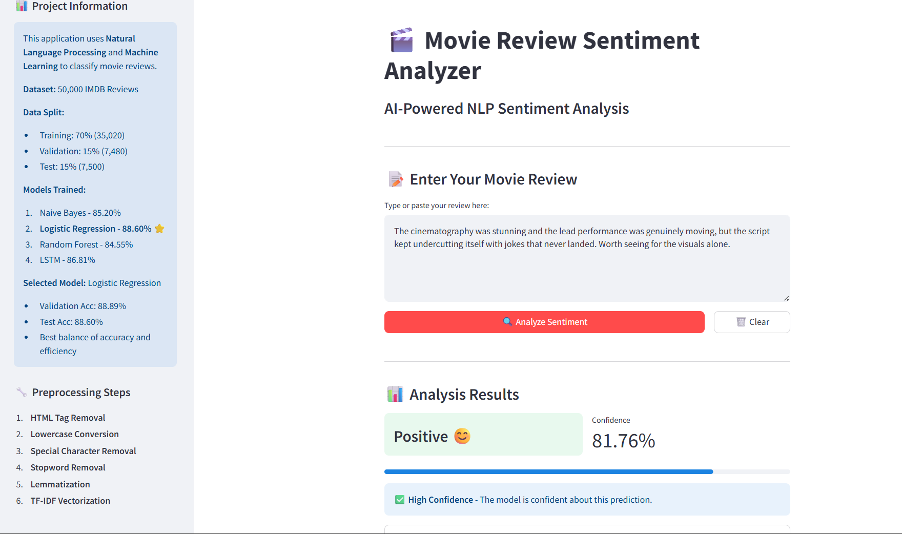

# 🎬 Movie Review Sentiment Analyzer

Four models trained on 50,000 IMDB reviews to classify sentiment. **Logistic Regression beat an LSTM by 1.8 points** at 88.60% test accuracy — using a fraction of the compute.

[](https://movie-sentiment-analyzer-nlp.streamlit.app)
[](https://www.python.org/)
[](LICENSE)

**▶️ [Try the live demo](https://movie-sentiment-analyzer-nlp.streamlit.app)** — paste any review, get a prediction with a confidence score.



---

## Results

Four classifiers, identical features, selected on a held-out validation set. The simplest competitive model won.

### Test set

| Model                   | Accuracy   | Precision | Recall   | F1       |
| ----------------------- | ---------- | --------- | -------- | -------- |
| **Logistic Regression** | **88.60%** | **0.88**  | **0.90** | **0.89** |
| LSTM                    | 86.81%     | 0.85      | 0.90     | 0.87     |
| Naive Bayes             | 85.20%     | 0.85      | 0.86     | 0.85     |
| Random Forest           | 84.55%     | 0.85      | 0.84     | 0.84     |

### Validation set — the basis for selection

| Model                   | Accuracy   | Precision | Recall   | F1       |
| ----------------------- | ---------- | --------- | -------- | -------- |
| **Logistic Regression** | **88.89%** | **0.88**  | **0.90** | **0.89** |
| LSTM                    | 87.03%     | 0.85      | 0.89     | 0.87     |
| Naive Bayes             | 85.39%     | 0.85      | 0.86     | 0.85     |
| Random Forest           | 84.47%     | 0.85      | 0.83     | 0.84     |

Logistic Regression won on validation and held up on test — a 0.29pp drop, meaning the selection generalized rather than overfitting the validation set.

### What training accuracy reveals that test accuracy hides

| Model               | Train       | Validation | Gap         | Reading            |
| ------------------- | ----------- | ---------- | ----------- | ------------------ |
| Naive Bayes         | 86.66%      | 85.39%     | 1.27pp      | Healthy            |
| Logistic Regression | 91.46%      | 88.89%     | 2.57pp      | Minimal            |
| LSTM                | 95.95%      | 87.03%     | 8.92pp      | Moderate           |
| **Random Forest**   | **100.00%** | **84.47%** | **15.53pp** | Severe overfitting |

**Random Forest classified its training data perfectly and still finished last.** A model that memorizes every example it has seen has learned the training set, not the problem. Test accuracy alone would show Random Forest merely trailing; the train-validation gap shows _why_.

The LSTM tells a quieter version of the same story: 95.95% on data it trained on, 87.03% on data it hadn't. More capacity, more memorization, no accuracy gain over a linear model on TF-IDF features.

---

## Methodology

### Data and splits

- **Source:** `tensorflow.keras.datasets.imdb` — 50,000 reviews, balanced 25k positive / 25k negative
- **Splits:** 35,020 train (70.0%) / 7,480 validation (15.0%) / 7,500 test (15.0%), stratified to preserve class balance
- **Test set touched once**, for the final number. Never used for model selection.

### Preprocessing

Each step is a standalone, unit-tested function:

| Function                | Does                                         | Tests cover                       |
| ----------------------- | -------------------------------------------- | --------------------------------- |
| `clean_text()`          | Strips HTML, lowercases, removes non-letters | HTML tags, mixed case, whitespace |
| `remove_stopwords()`    | NLTK stopwords                               | Common stopwords, mixed content   |
| `lemmatize_text()`      | WordNet lemmatization to base forms          | Verbs, plural nouns, adjectives   |
| `preprocess_pipeline()` | Composes all three                           | Integration test on a full review |

**A note on the HTML handling.** `clean_text()` strips `<br>` tags and other markup, and is unit-tested against raw HTML input. On _this_ data it's a no-op: the Keras IMDB dataset ships pre-tokenized with punctuation and HTML already removed, and the pipeline decodes integer sequences back to text. The function is written defensively so it also works on the raw-HTML version of the dataset — but it isn't doing work here, and this README doesn't claim otherwise.

### Features

- **Classical models:** TF-IDF capped at 5,000 features
- **LSTM:** tokenization + padding to length 200, vocab 5,000, embedding dim 128
- **No leakage:** the vectorizer is fit on training data only, then applied to validation and test

---

## Quick Start

**Requires Python 3.11.** TensorFlow 2.14 doesn't support 3.12+, and the pinned numpy has no wheels above 3.11.

```bash
git clone https://github.com/Ghadiiz/movie-sentiment-analyzer-nlp.git
cd movie-sentiment-analyzer-nlp
pip install -r requirements.txt
streamlit run app.py
```

Opens at `http://localhost:8501`. **The trained model and vectorizer ship with the repo**, so this runs out of the box — no training required. NLTK corpora download automatically on first launch.

### Retraining from scratch

```bash
pip install -r requirements-dev.txt   # adds TensorFlow and notebook tooling
jupyter notebook Movie_Sentiment_Analysis.ipynb
```

Run all cells. The final cell regenerates the `.pkl` files. Budget 20–50 minutes on CPU — the LSTM is the slow part.

<details>
<summary><b>Troubleshooting</b></summary>

| Problem                      | Cause and fix                                                                                     |
| ---------------------------- | ------------------------------------------------------------------------------------------------- |
| `InconsistentVersionWarning` | Your scikit-learn differs from the version that pickled the model. Install `scikit-learn==1.3.2`. |
| `ModuleNotFoundError`        | `pip install -r requirements.txt`                                                                 |
| Port already in use          | `streamlit run app.py --server.port 8502`                                                         |
| numpy fails to build         | You're on Python 3.12+. Use 3.11.                                                                 |

</details>

---

## Example Predictions

| Review                                                                | Prediction | Confidence |
| --------------------------------------------------------------------- | ---------- | ---------- |
| "This movie was absolutely fantastic! I loved every single moment."   | Positive   | 94.56%     |
| "Terrible acting, weak plot, and poor direction. Avoid at all costs." | Negative   | 99.99%     |
| "It had its moments, but overall it was just an average film."        | Negative   | 78.82%     |

The third one is the informative case: a genuinely mixed review, and the model's confidence drops to 78.82% instead of asserting a confident answer. Binary classification has no "neutral" to reach for, so ambivalence surfaces as low confidence rather than a wrong-but-certain label.

---

## Project Structure

```
movie-sentiment-analyzer-nlp/
├── app.py                          # Streamlit app — loads model, serves predictions
├── Movie_Sentiment_Analysis.ipynb  # EDA → preprocessing → training → evaluation
├── logistic_regression_model.pkl   # Trained classifier
├── tfidf_vectorizer.pkl            # Fitted vectorizer (train-only fit)
├── requirements.txt                # App runtime deps
├── requirements-dev.txt            # Notebook / training deps
└── prompt_log.md                   # Development methodology log
```

## Tech Stack

**App:** Streamlit · scikit-learn · NLTK · BeautifulSoup
**Notebook:** pandas · NumPy · TensorFlow/Keras · matplotlib · seaborn

## Limitations

- **Domain-specific.** Trained on movie reviews; would need retraining for product reviews or social media.
- **Binary only.** No neutral class. Mixed reviews surface as low confidence, not as a category.
- **No word order.** TF-IDF is a bag of words — sarcasm and negation scope are invisible to it. "Not good" and "good" share a token.
- **English only.**

## Documentation

- **[`prompt_log.md`](prompt_log.md)** — a record of the 18 AI prompts used during development, documenting how the pipeline was scaffolded phase by phase.
- Every function carries a docstring; unit tests print input, expected, actual, and PASS/FAIL per case.

## License

MIT — see [LICENSE](LICENSE).
